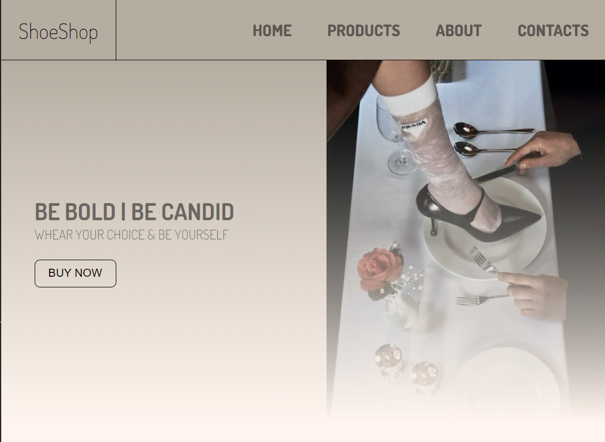
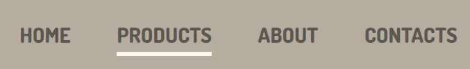
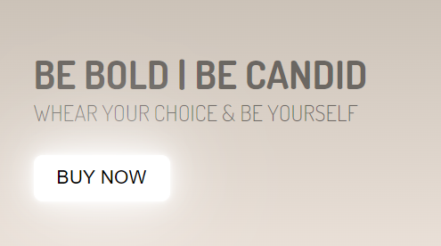
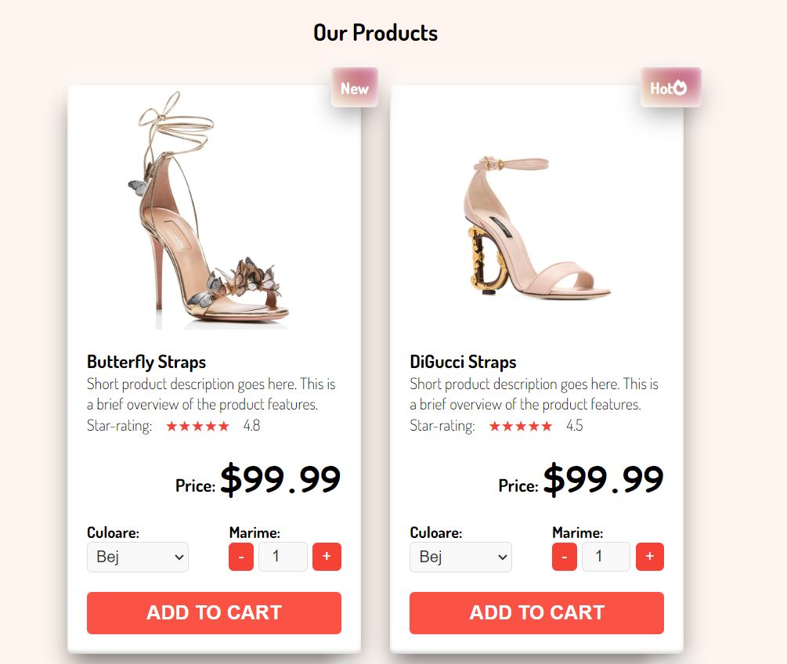
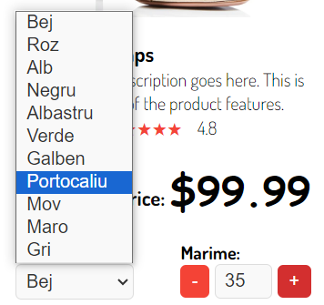
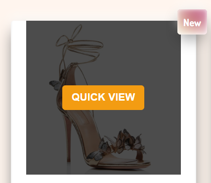

# Shoe E-Shop Site Project

This project is a challenge to create a website with product cards that have a more complex structure and in general the site must be adaptive.

## Home Page

Menu is simple and in a minimalistic style. The active element is just undelined to show that your cursor is on it.

Also the site have an image and an eye catching quote with an action button. The qoute and the button are visible in images below.

## Product Page

THere you can see the presented products on this e-shop.

In plus the site is window size adjustible and the changes are visible in image below.

To be able to select the needed color of the product we have a select bar and also a bar to select the right shoe size.

Also, there is a hover for a quick view of the product.

The Add to cart button becomes bigger in size when the cursor is on it, but in picture the change is not visible. The change is more remarkable in action not on image.

## Footer

Here is a simple footer where social media icons are clickable and send you to my social media accounts of the seller.

This is all!

Thank you for reading!
