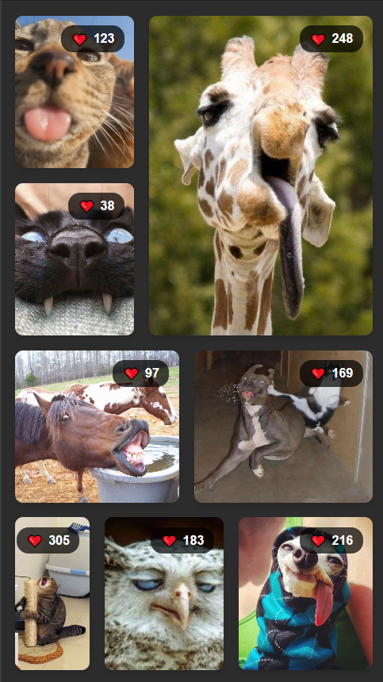
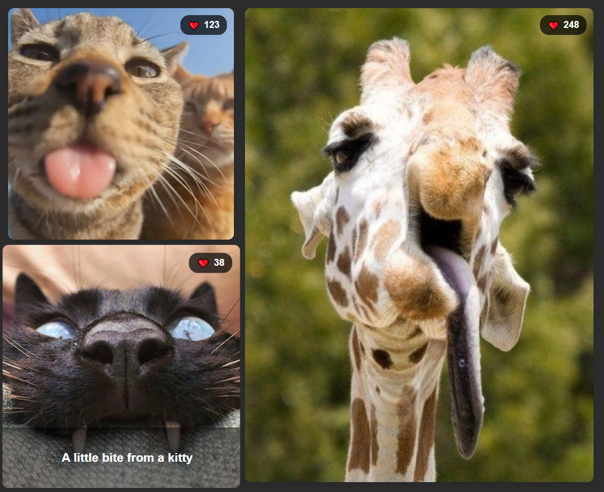

# Gallery Project

The aim of this project is to practice our grid knowledge and to play with its elements. Also to make a hover that descrbe the image from gallery. I decided to make a funny gallery with lovely animals because I really adore them.

When the cursor is pointed on any image, a little description of the image appears on the bottom of the image.

So the task is done!

Thank you for reading!
