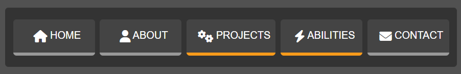
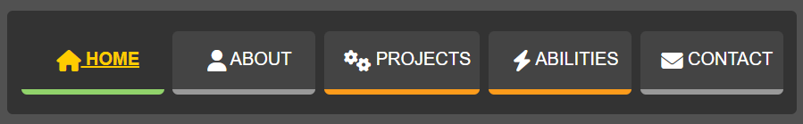
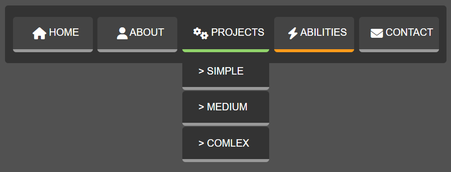
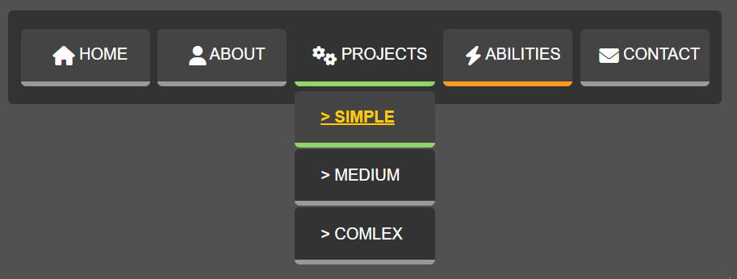

# Menu Dropdown Project

The aim of this project is to creat a menu dropdown. The design decisions were free to our imagination and research of templates.

## The simple appearance

Menu elements are presented in boxes in grey pallette. The dropdown elements are underlined with yellow lines. 

When the cursor is pointed on any element it chages the appearance as shown in the image below.

The simple dropdown menu looks like in the next image.

The active element from dropdown is underlined with yellow line and the text also is yellow.

That is all!

Thank you for reading!
