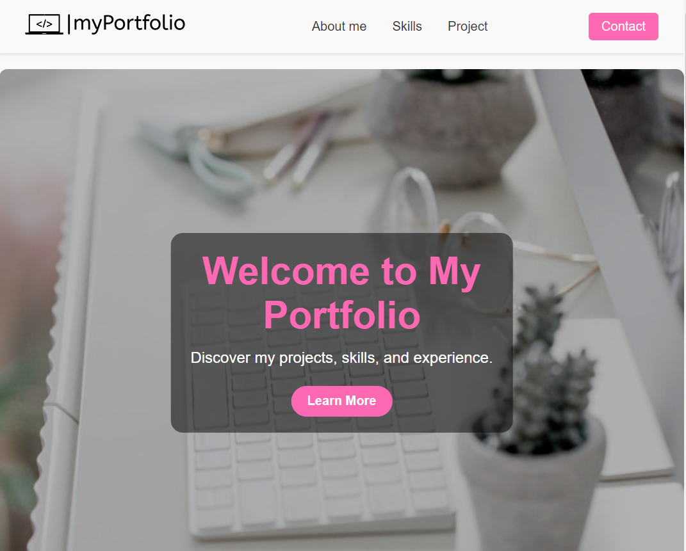
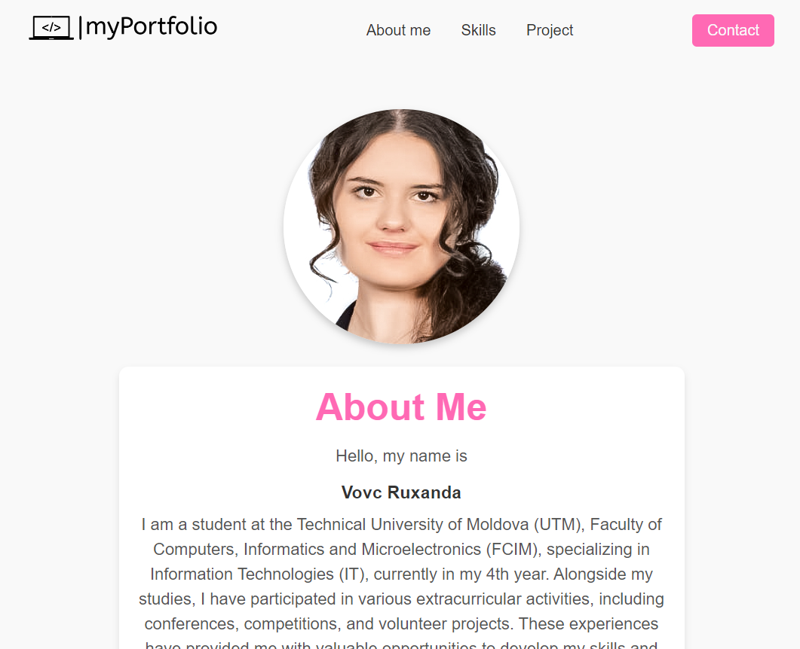
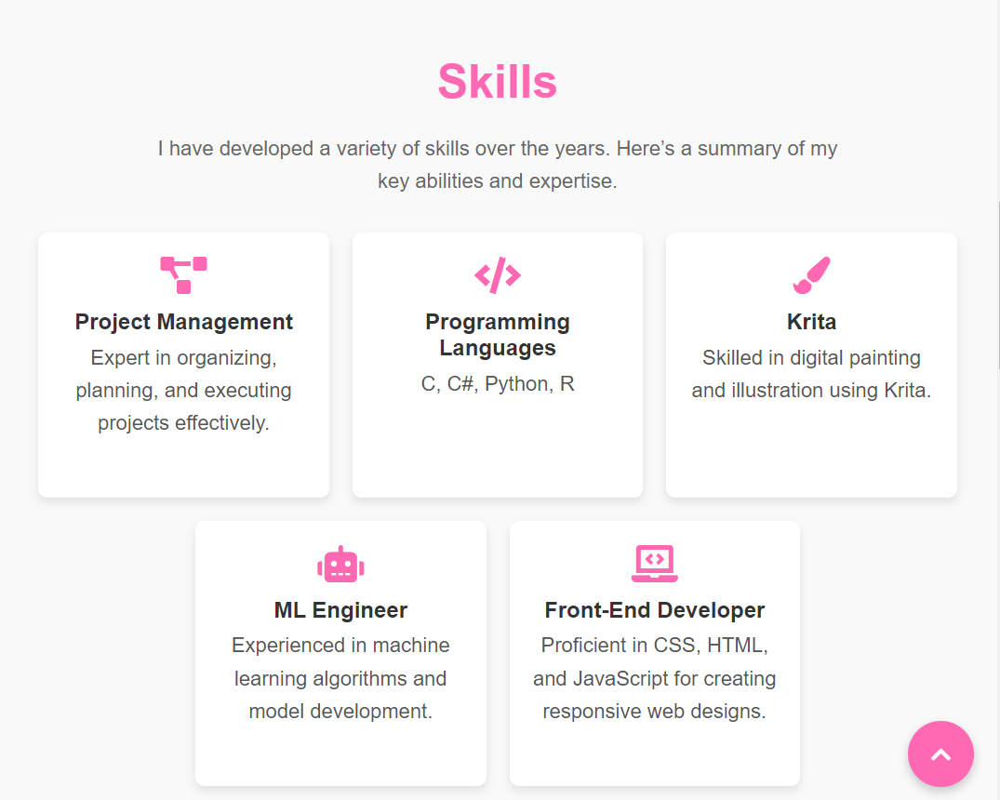
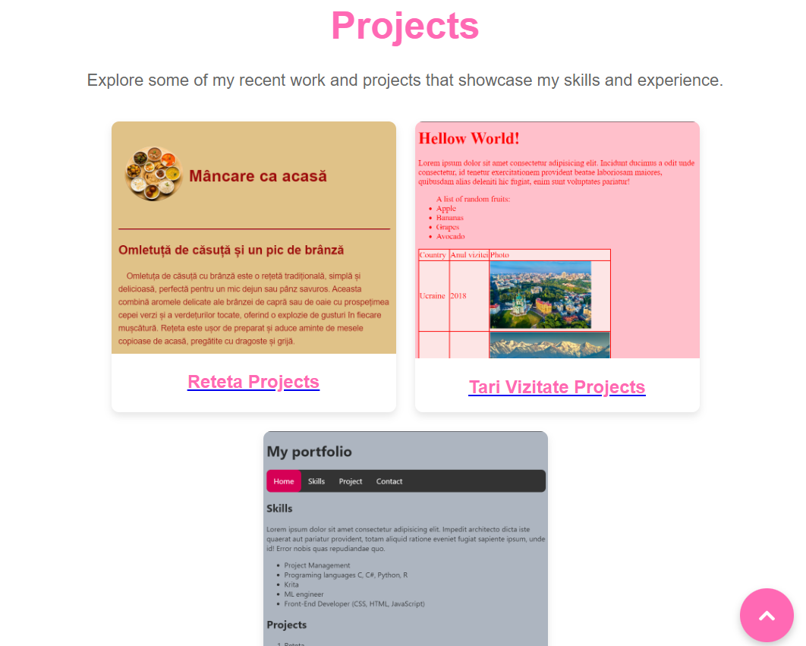
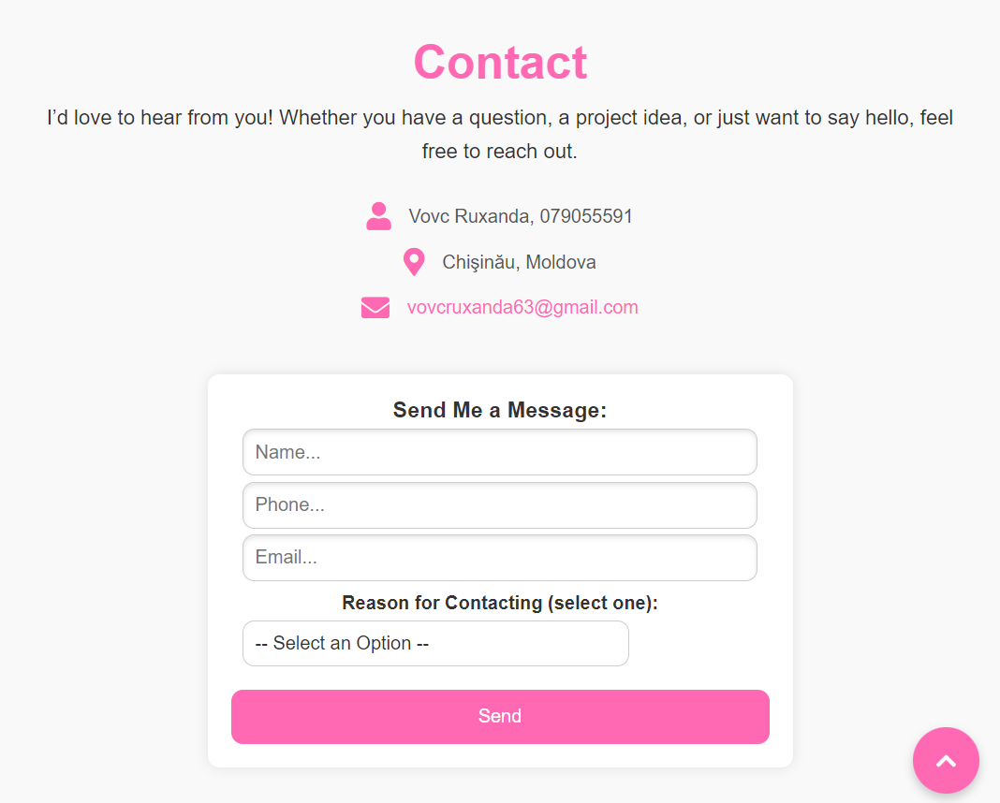
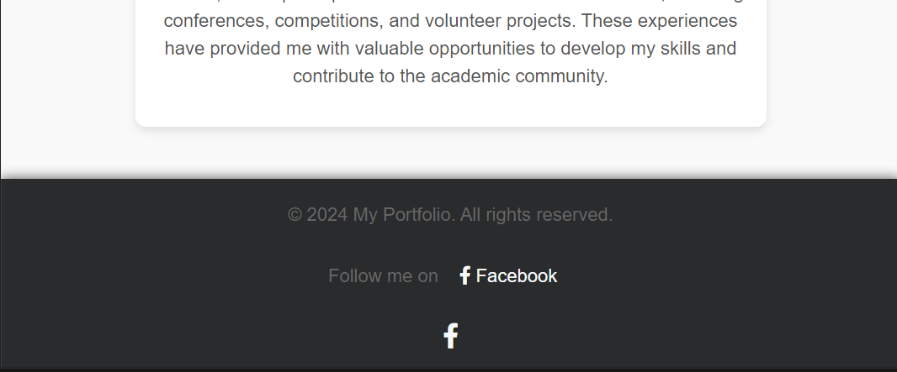

# Tea Site Project

This project is like a short CV. The design is really for girl girls and have pink accents.

## Home Page

Menu is simple and just the selected menu ar is changing text color on pink. The logo is AI generated. The cover image has the same color palette as the site and have a proffesional content. Also the cover style is inspired from the tribute page and also have this active button that sends you to the About me page.

## About me Page

This part has a short description about me and an image of me, so, you can see how beautiful I am :)

## Skills Page

Here is a list of skills that are shown as cards with representative icons and information.

## Project Page

Also the list of the projects are show as cards and by clicking it you can open the my real old projets.

## Contact Page

This page is a simple formular were people can send me mesages.

## Footer

Here is a simple footer where social media icons are clickable and send you to my facebook. Also you can see the button that send you to the top of the page.

So that is it!

Thank you for reading!
