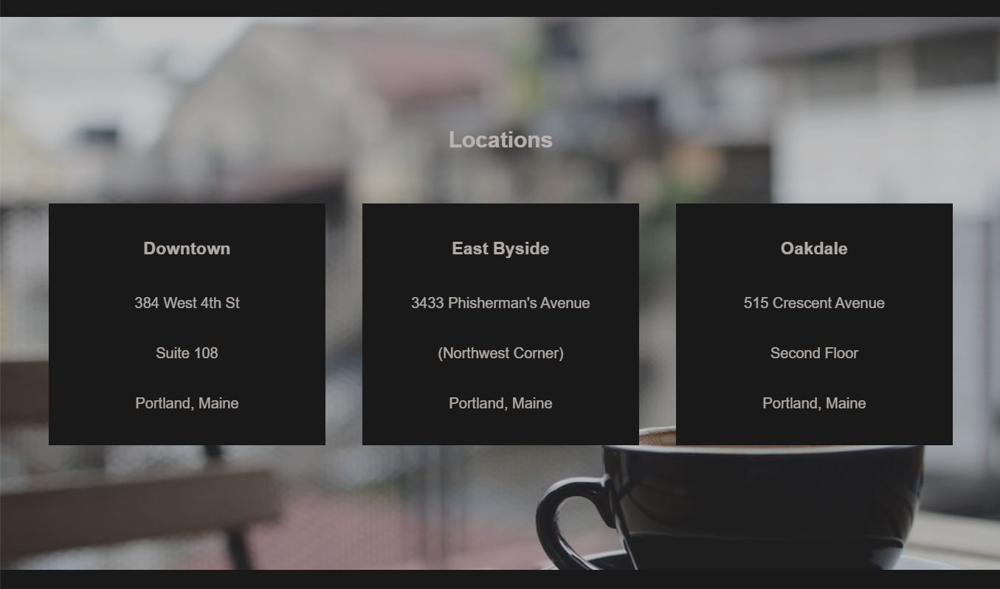

# Tea Site Project

In this project we had to match the presentated template by our teacher and verify our accumulated skills. Firstly, i didn't understand this and started my own project so... here wil be presented both of them.

## Project Teacher Template

## Home Page

The site have a very simple menu that is underlined as it is visible in the image below. Also there is a simple logo and a cover image with the mission of this tea factory.

## Tea of the Month

This part of the site show the top 5 teas of the month and they are poping up when cursor is on the image.

## Locations

Here we see a cover image and on top of it 3 simle cards with tea factory locations.

## Footer

Here is a simple footer.

Finally, all the elements of my page match the teachers template and I proved my abilities.

So let's go to the next site that I started!

## Project My Vision

Here is my project that I started by mistake, but Ireally love how it looks. My only trouble here is that the tea leaves is not centered and I can't make them to be so. I tryed but with shame I can say that I failed. If you see were is my mistake, I am open to any suggestions, remarks and any comment on y work :)

Next I would like to show you my design decisions in this project that I really enjoyed to impliment.

Firstly, it's the menu and how each element is shown when the cursor is on it. Also was very hard to center the menu to be in this position. Also the logo was created with help of AI.

Secondly, the search bar is really stylish and I like how it changes when you try to type something.

Finally, I would like to remark the button and how beautiful it looks when you press on it.

As you can see, I really enjoyed making this project and maybe one day I will finish it.

Thank you for reading!
