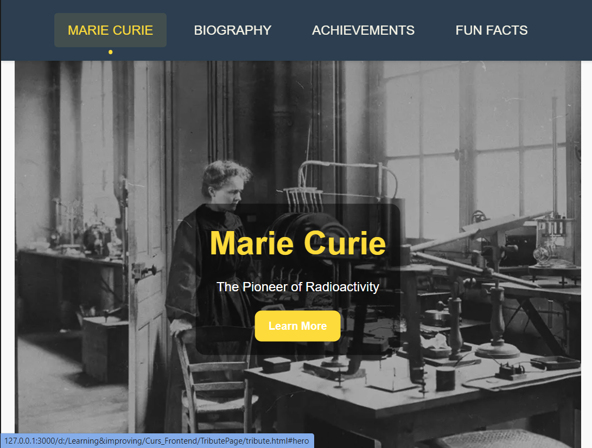
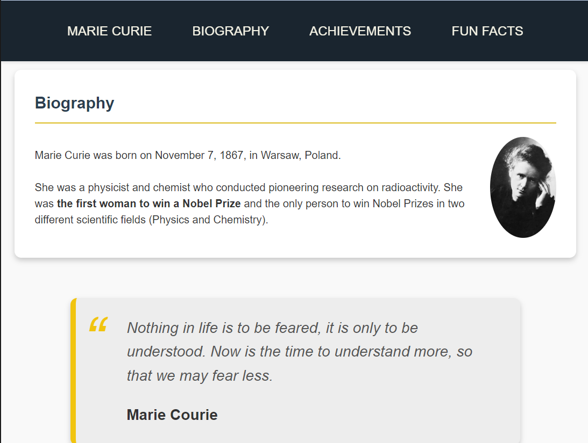
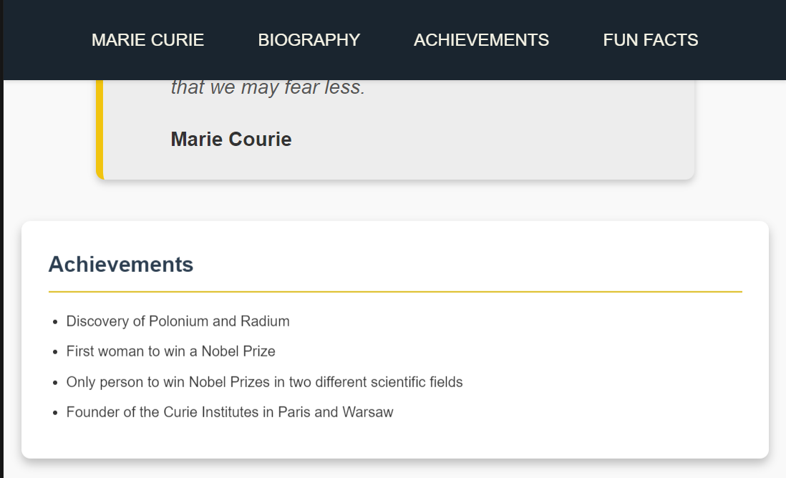
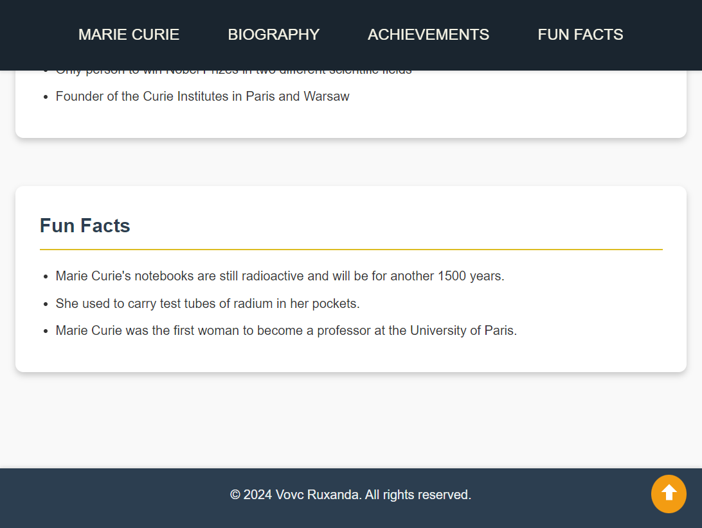

# Tribute Page Project

This is a simple project dedicated to a selected famous people. I really love science so I made a tribute page for Marie Curie.

## Preview

We see a styled menu and a cover image that catch attention of the reader with an action button. The colors are matched to the science domain that is representated by Marie Curie.

All next paragraphs are styled in cards to have a more modern design.

## Biografy

## Achievements

## Fun Facts

Also at the bottom of the page we see the footer and the yellow button that take us to the top of the page.

Thank you for reading! :)
